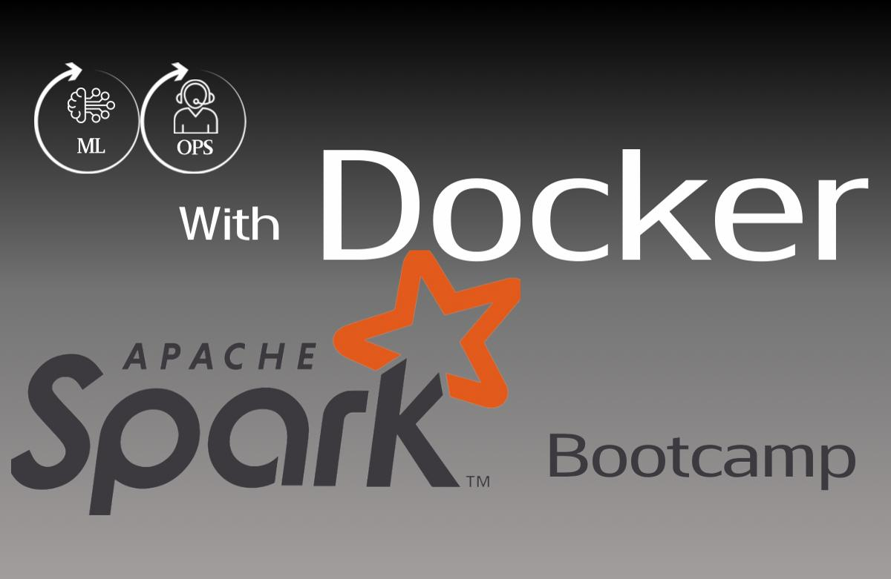

# Docker Spark Engine Course

Welcome to the Docker Spark Engine course, a comprehensive tutorial designed to teach you how to build robust data processing engines using Docker and Apache Spark. This course is ideal for software developers, data engineers, and anyone interested in data analytics and processing.

## Course Overview
In this course, you will learn the fundamentals of Docker and Apache Spark, and how to integrate them to create a powerful data processing engine. The course covers the basics of Docker containers, Apache Spark architecture, and practical examples to handle real-world data processing tasks.

## What You Will Learn
- **Docker Fundamentals**: Understand the basics of Docker, including container management and Dockerfile configuration.
- **Apache Spark Basics**: Dive into Apache Spark to learn about its architecture, core abstractions, and distributed data processing capabilities.
- **Integration Techniques**: Learn how to integrate Docker and Apache Spark to streamline development and deployment of data processing tasks.
- **Real-world Applications**: Apply your knowledge to set up a Docker-based Spark environment for analyzing large datasets.

## Course Features
- Hands-on tutorials with step-by-step instructions.
- Access to real-world examples and case studies.
- Interactive quizzes to test your understanding.
- A dynamic link to continuously updated course materials.

## Target Audience
This course is designed for:
- Developers and engineers looking to leverage Docker for data processing.
- Data engineers seeking to enhance their skills in distributed data processing.
- Students and professionals interested in learning about modern data engineering tools.

## Prerequisites
Participants should have:
- Basic understanding of command line tools and operations.
- Familiarity with the principles of data processing and software development.
- No prior experience with Docker or Apache Spark is required, but it is helpful.

## Enrollment
You can enroll in this course by visiting the following link: [Enroll in Docker Spark Engine Course](https://www.inflearn.com/course/%EB%8F%84%EC%BB%A4-%EC%8A%A4%ED%8C%8C%ED%81%AC-%EC%97%94%EC%A7%84-%EB%A7%8C%EB%93%A4%EA%B8%B0)

## Instructor Contact
For any queries regarding the course content or registration details, please contact the course instructor via email or through the course forum on Inflearn.

Thank you for your interest in the Docker Spark Engine course. We look forward to helping you expand your data engineering skills with Docker and Apache Spark!
